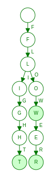

# <!-- omit in toc --> Problem 4 - Longest Common Prefix

> Leetcode Link: [Longest Common Prefix](https://leetcode.com/submissions/detail/730808235/).

- [Statement](#statement)
- [Examples](#examples)
- [Solution 1 - Vertical Scanning](#solution-1---vertical-scanning)
  - [Concept](#concept)
  - [Implementation Details](#implementation-details)
  - [Example](#example)
  - [Time complexity](#time-complexity)
- [Solution 2 - Use a Trie](#solution-2---use-a-trie)
  - [Concept](#concept-1)
  - [Implementation Details](#implementation-details-1)
  - [Example](#example-1)
  - [Time complexity](#time-complexity-1)

## Statement

Write a function to find the longest common prefix string amongst an array of strings.

If there is no common prefix, return an empty string `""`.

## Examples

```block
Input: strs = ["flower","flow","flight"]
Output: "fl"
Example 2:
```

```block
Input: strs = ["dog","racecar","car"]
Output: ""
Explanation: There is no common prefix among the input strings.
```

## Solution 1 - Vertical Scanning

### Concept

> **Assertion**: If two or more strings have a common prefix, then they have the same character at the same index until the end of the of common prefix.

Take the first string.

For each character in the first string, compare the corresponding character in the remaining strings. If any of the strings do not have the matching character, return a slice of the first string upto one less than the index of the character.

If no return occurs in this loop, return the first string since the first string is the longest common prefix.

### Implementation Details

It may be that a string in the remaining strings is smaller than the first string. In this case, we do not need to compare any more strings since the longest common prefix cannot be longer than the length of the smallest string. Thus, the actual return condition in the loop checks:

- Index of the current character is `>=` length of the current string or,
- The current character does not match the corresponding character in the current string.

```python
if idx >= len(string) or string[idx] != char:
```

If either are true, the algorithm can return.

### Example

**Input**

```block
strs = ["flower","flow","flight"]
```

**Procedure**

- `first = flower`, `remaining = ["flow", "flight"]`
- Iteration 1:
  - `idx = 0`, `char = f`
  - Iteration 1:
    - `string = flow`
    - Since `idx` is not `>= len(flow)` and `string[0] == f`, no return occurs.
  - Iteration 2:
    - `string = flight`
    - Since `idx` is not `>= len(string)` and `string[0] == f`, no return occurs.
- Iteration 2:
  - `idx = 1`, `char = l`
  - Iteration 1:
    - `string = flow`
    - Since `idx` is not `>= len(flow)` and `string[1] == l`, no return occurs.
  - Iteration 2:
    - `string = flight`
    - Since `idx` is not `>= len(string)` and `string[1] == l`, no return occurs.
- Iteration 3:
  - `idx = 2`, `char = o`
  - Iteration 1:
    - `string = flow`
    - Since `idx` is not `>= len(flow)` and `string[2] == o`, no return occurs.
  - Iteration 2:
    - `string = flight`
    - Since `idx` is not `>= len(string)` but `string[2] != o` (`string[2] = i`), return `first[:idx] = fl`.

### Time complexity

The solution loops over each character in the first string and for each character, loops over the list of remaining strings.

In general, the time-complexity is $\mathcal{O}(S)$, where $S=\sum_{i=0}^{n-1}len(strs[i])$.

In the worst-case, all $n$ strings have the same length $m$, giving a complexity of $\mathcal{O}(n*m)$.

In the best case, the time complexity is $\mathcal{O}(n*m_{min})$, where $m_{min}$ is the minimum length of a string.

## Solution 2 - Use a Trie

### Concept

> Note: To learn about the Trie data structure, see [Trie](https://en.wikipedia.org/wiki/Trie).

A trie node has the following structure:

```python
class Node:
    value: str | None
    is_leaf: bool
    children: dict[int, str]
```

First, build a trie for the list of strings by inserting each string one by one in the trie using the standard trie insertion procedure ([source](https://en.wikipedia.org/wiki/Trie#Insertion)):

```python
def trie_insert(
    root: Node,
    key: str,
    value: str = None
):
    x = root

    for char in key:
        i = ord(char.lower()) - ord("a")
        if x.children[i] is None:
            x.children[i] = Node()
        x = x.children[i]

    x.value = value
    x.is_leaf = True
```

Initialize an empty string to store the final prefix.

Then, starting at the root node, traverse the tree while the current node has a single child and is not a leaf node. For each such node, append the `value` attribute of the only child to the final prefix and change the current node to the only child.

Return the final prefix at the end.

### Implementation Details

When the `value` argument is not provided to the insertion procedure and the string being inserted is not empty, `x.value` is set to the last character.

```python
def trie_insert(
    root: Node,
    key: str,
    value: str = None
):
    x = root

    for char in key:
        i = ord(char.lower()) - ord("a")
        if x.children[i] is None:
            x.children[i] = Node(value=char)
        x = x.children[i]

    if value is None and len(key) != 0:
        value = char

    x.value = value
    x.is_leaf = True
```

### Example

**Input**

```block
strs = ["flower","flow","flight"]
```

**Procedure**

- Build the trie. The filled in nodes represent leaf nodes. Let the trie be called `trie`.



- `prefix = ""`, `node = trie.root`.
- Iteration 1:
  - Since `node` has a single child and is not a leaf, change `node` to the single child.
  - `prefix = "" + node.value = f`.
- Iteration 2:
  - Since `node` has a single child and is not a leaf, change `node` to the single child.
  - `prefix = f + node.value = fl`.
- Iteration 3:
  - Since `node` has more than one child, stop
- Return `prefix = fl`.

### Time complexity

The trie can be built in time $\mathcal{O}(S)$, where $S=\sum_{i=0}^{n-1} len(strs[i])$.

In the worst-case, all $n$ strings are equal and have the same length $m$. Thus, $S=n*m$ and the trie will be traversed to a depth of $m$. This gives an overall worst-case time complexity of $\mathcal{O}(n*m)$.

The space complexity is $O(S)$.
